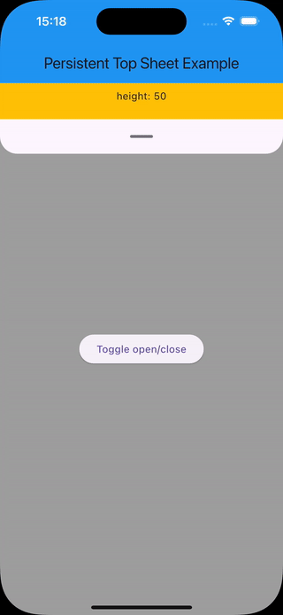

<!-- 

This README describes the package. If you publish this package to pub.dev,
this README's contents appear on the landing page for your package.

For information about how to write a good package README, see the guide for
[writing package pages](https://dart.dev/guides/libraries/writing-package-pages). 

For general information about developing packages, see the Dart guide for
[creating packages](https://dart.dev/guides/libraries/create-library-packages)
and the Flutter guide for
[developing packages and plugins](https://flutter.dev/developing-packages). 

commands :

dart doc
dart format .
flutter pub publish --dry-run
-->


Add fully customisable top sheets to your flutter apps, anchored at the top and controllable via gestures or controller.

You need something else ? Feel free to create issues, contribute to this project or to ask for new features on [GitHub](https://github.com/tempo-riz/persistent_top_sheet) !


## Features

- Fully customizable top sheets for any use case.
- Smooth animations for open, close, and drag interactions.

### Demo




## Getting started

To get started, add the package to your pubspec.yaml file:

`flutter pub add persistent_top_sheet`

Then, import the package into your Dart file:

`import 'package:persistent_top_sheet/persistent_top_sheet.dart';`


## Usage

First create the client with optional parameters
```dart
// if you want to use the controller, you can use open(), close() or toggle()
// otherwise you can drag the handle by default
final controller = PersistentTopSheetController();

PersistentTopSheet(
    maxHeight: 500,
    minHeight: 50,
    controller: controller,
    childBuilder: (currentHeight) => SheetBody(currentHeight: currentHeight),
    handleBuilder: (currentHeight) => const DragHandle(),
    onStateChanged: (state) => debugPrint('isOpen: $state'),
);
```

There is a ready-to-use example in the `/example` folder.


## Additional information

I created this package for my own needs. Happy to share !

Don't hesitate to ask for new features or to contribute on [GitHub](https://github.com/tempo-riz/persistent_top_sheet) !

## Support

If you'd like to support this project, consider contributing [here](https://github.com/sponsors/tempo-riz). Thank you! :)